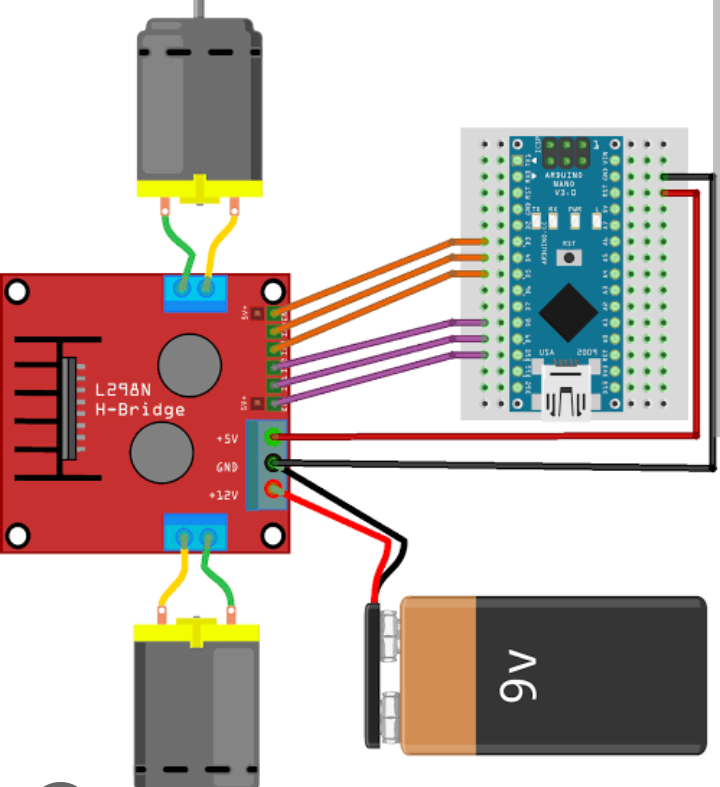

# 4-Wheel Smart Car with ESP8266 (ESP-12E/NodeMCU)

This project creates a smart car using an ESP8266 (NodeMCU), which is controlled through a Wi-Fi hotspot and a mobile-friendly web interface. The car supports forward, backward, left, right, stop, and speed control functions.

---

## 1. Components Required

- NodeMCU (ESP8266)
- L298N Motor Driver Module
- 2x Gear Motor Pair (4 motors)
- Power Supply (Battery Pack – 7.4V or 12V)
- Connecting Wires
- Breadboard or Soldered Chassis
- Smartphone or Laptop (for controlling via browser)

---

## 2. Circuit Connections

| ESP8266 Pin | Motor Driver (L298N) | Function                |
|-------------|----------------------|--------------------------|
| D1          | IN1                  | Left Motor Direction 1   |
| D2          | IN2                  | Left Motor Direction 2   |
| D5          | ENA                  | PWM for Left Motor       |
| D3          | IN3                  | Right Motor Direction 1  |
| D4          | IN4                  | Right Motor Direction 2  |
| D6          | ENB                  | PWM for Right Motor      |
| GND         | GND                  | Common Ground            |
| VIN         | VCC (Optional)       | Power L298N if needed    |

> **Note:** ENA and ENB are PWM-enabled pins to control speed using `analogWrite()`.

---

## 3. Flashing the Code to ESP8266

### Prerequisites

- Arduino IDE installed
- ESP8266 board support added (via Boards Manager)
- USB Cable

### Steps

1. Open Arduino IDE
2. Go to **Tools > Board > NodeMCU 1.0 (ESP-12E)**
3. Select the correct **COM port** under **Tools > Port**
4. Paste the full code
5. Click **Upload** (Arrow Button)
6. Open Serial Monitor at **115200 baud** to check the hotspot IP

---

## 4. Web Control Interface

- ESP8266 creates a Wi-Fi hotspot:
  - **SSID**: `SmartCar_4WD`
  - **Password**: `12345678`
- Connect your phone to this Wi-Fi
- Open browser and go to:  
  `http://192.168.4.1`
- You’ll see a control panel with buttons for:
  - Forward
  - Backward
  - Left
  - Right
  - Stop
  - Speed Control Slider

---

## 5. How It Works (Control Process)

- ESP8266 runs a web server using `ESP8266WebServer`
- Button clicks send URLs like:
  - `/forward`, `/backward`, `/left`, `/right`, `/stop`
  - `/speed?value=800` for speed control
- These endpoints activate motor actions in the code
- Speed is controlled using PWM (0–1023)
- The system is completely offline and works via hotspot

---

## 6. Module Overview

| Module         | Purpose                                        |
|----------------|------------------------------------------------|
| ESP8266        | Main controller and Wi-Fi server               |
| L298N          | Motor driver for controlling 4 motors          |
| Web Interface  | HTML + JS for real-time browser-based control  |
| Power Supply   | Powers both ESP and motors (2-cell Li-ion)     |

---

**Made with love using ESP8266 + L298N!**
